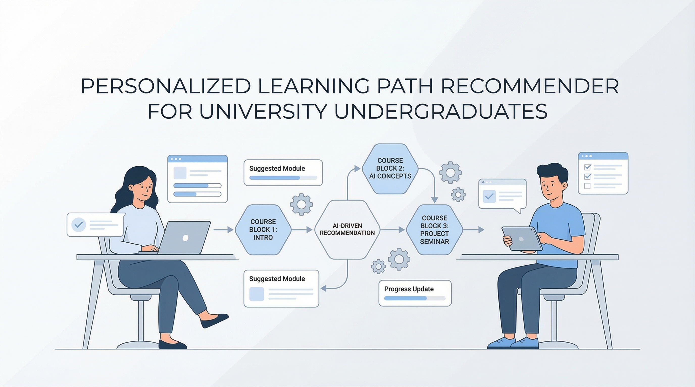

# Personalized Learning Path Recommender - Research Project

<p align="center">
  
</p>

The Personalized Learning Path Recommender is an applied research and system-development project that leverages Neo4j knowledge graphs and AI-driven recommendations to create personalized learning paths for university students, optimizing their course selection and academic progression.

At its core, this system addresses a critical need in higher education: university undergraduates often struggle with course selection, understanding skill dependencies, and planning optimal learning progressions. The system provides a digital ecosystem that connects course discovery, skill mapping, personalized recommendations, and intelligent path planning into one cohesive platform.

The project aims to become a pioneering AI-powered academic planning tool. By integrating knowledge graphs, machine learning algorithms, and cross-domain course analysis, it enhances student learning experiences and improves educational outcomes for university undergraduates.

## 📃 Overall System Architecture

<p align="center">
  
</p>

## 🧩 Core System Components

| Component                                                  | Description                                                                                                                                                                                                      |
| ---------------------------------------------------------- | ---------------------------------------------------------------------------------------------------------------------------------------------------------------------------------------------------------------- |
| **Course Knowledge Graph Generator**                       | • Extracts concepts and relationships from course data.<br>• Builds graph structure representing course dependencies and skill mappings.<br>• Integrates with massive open online course (MOOC) data sources.    |
| **Course Prioritization & Timetable Generator (ML-based)** | • Understands selected courses and matches with credit values.<br>• Collects assigned credits and prioritizes by weight.<br>• Generates optimized timetables using machine learning algorithms.          |
| **Learner Profile Classifier**                             | • Data preprocessing and embedding generation for student categorization.<br>• Classification model for personalized learner profiles.<br>• Tracks learning patterns and skill acquisition.                      |
| **Progress Tracking & Adaptive Visualizer**                | • Identifies students requiring additional support.<br>• Generates personalized learning recommendations.<br>• Assessment module with interactive visualizations.<br>• Adaptive retraining based on performance. |

## Research Purpose

This research aims to develop and evaluate an AI-driven knowledge graph ecosystem that supports university undergraduates by:

- Enhancing course discovery through intelligent search and filtering
- Reducing decision-making complexity using data-driven recommendations
- Providing structured and adaptive learning path planning
- Delivering personalized skill-based course suggestions to improve learning outcomes

## Methodology

The project follows a rigorous, data-driven, and user-centered approach that includes:

- **Graph-based data modeling** combining course relationships, skills, and university metadata
- **Machine learning algorithms** for course similarity, recommendation generation, and path optimization
- **Neo4j knowledge graph** for efficient relationship traversal and pattern discovery
- **RESTful API architecture** for scalable, secure, and modular service integration

## 🔗 System Dependencies

| Category                        | Technologies / Tools                                               | Purpose                                                                                     |
| ------------------------------- | ------------------------------------------------------------------ | ------------------------------------------------------------------------------------------- |
| **Frontend (Web Application)**  | React, TypeScript, Vite, D3.js, TailwindCSS, Axios                 | Builds the student-facing web application with interactive visualizations and responsive UI |
| **Backend & API Services**      | Python, FastAPI, Uvicorn, Pydantic, JWT, dotenv                    | Manages authentication, business logic, secure RESTful APIs, and data validation            |
| **Graph Database**              | Neo4j 5.x, Cypher Query Language, Neo4j Driver for Python          | Stores and queries course relationships, skills, and learning path connections efficiently  |
| **AI / Machine Learning**       | Sentence-Transformers, Scikit-learn, Pandas, NumPy                 | Enables semantic search, course similarity analysis, and personalized recommendations       |
| **Data Processing**             | Python, Pandas, NumPy, Matplotlib, Seaborn                         | Handles data cleaning, preprocessing, analysis, and visualization in Jupyter notebooks      |
| **Cloud & Storage**             | Neo4j Aura (optional), CSV data storage, REST APIs                 | Provides scalable database hosting, data persistence, and service communication             |
| **Security**                    | Environment Variables (.env), Password Hashing, CORS Configuration | Ensures secure API access, credential management, and cross-origin resource sharing         |
| **Development & Collaboration** | Git, GitHub, VS Code, Postman, Jupyter Notebooks                   | Supports version control, API testing, data exploration, and development workflows          |

## 📊 Knowledge Graph Structure

### Nodes

- **Course**: `{id, name, description, rating, url}`
- **University**: `{name}`
- **Skill**: `{name}`
- **DifficultyLevel**: `{level, order}`

### Relationships

- `(Course)-[:OFFERED_BY]->(University)`
- `(Course)-[:TEACHES]->(Skill)`
- `(Course)-[:HAS_DIFFICULTY]->(DifficultyLevel)`
- `(Course)-[:SIMILAR_TO {common_skills}]-(Course)`
- `(Skill)-[:RELATED_TO {strength}]-(Skill)`

## 🚀 Getting Started

### Prerequisites

1. **Python 3.8+**
2. **Neo4j Database**
   - Download [Neo4j Desktop](https://neo4j.com/download/) OR
   - Use [Neo4j Aura](https://neo4j.com/cloud/aura/) (Cloud)

### Installation

1. **Clone the repository**

```bash
cd "course scrape"
```

2. **Install dependencies**

```bash
pip install -r requirements.txt
```

3. **Configure Neo4j**

   - Copy `.env.example` to `.env`
   - Update with your Neo4j credentials:

   ```env
   🏷️ Expected Outcomes
   ```

- Improved course selection efficiency and academic planning
- Reduced decision-making complexity for students
- AI-powered personalized learning path recommendations
- Enhanced skill mapping and prerequisite understanding
- A scalable knowledge graph solution for educational institutions

## 👥 Research Team

| Name                   | Role                             | GitHub                                             |
| ---------------------- | -------------------------------- | -------------------------------------------------- |
| **Disanayaka H.M.S.D** | Principal Researcher / Team Lead | [@Sachinthadilz](https://github.com/Sachinthadilz) |
| **Thennakoon H.M.U.N** | Researcher                       | [@username](https://github.com/username)           |
| **Rajapaksha.H**       | Researcher                       | [@himashirajapaksha](https://github.com/himashirajapaksha)  |
| **[Team Member 4]**    | Researcher                       | [@username](https://github.com/username)           |

---

## NEO4J_URI=bolt://localhost:7687

NEO4J_USER=neo4j
NEO4J_PASSWORD=your_password

````

4. **Import data into Neo4j**

```bash
cd backend
python data_loader.py
````

This will:

- Create indexes for performance
- Import 3,500+ courses
- Create skill relationships
- Compute course similarities

5. **Start the API server**

```bash
cd backend
python main.py
```

API will be available at: `http://localhost:8080`

6. **Start the Frontend** (Optional)

```bash
cd frontend
npm install
npm run dev
```

Frontend will be available at: `http://localhost:5173`

## 📚 API Documentation

Once the server is running, visit:

- **Interactive API Docs**: http://localhost:8000/docs
- **ReDoc**: http://localhost:8000/redoc

### Key Endpoints

#### Course Search

```http
POST /courses/search
{
  "query": "Python programming",
  "difficulty": "Beginner",
  "min_rating": 4.5,
  "limit": 10
}
```

#### Get Course Details

```http
GET /courses/{course_id}
```

#### Get Recommendations

```http
POST /recommendations
{
  "skills": ["Python Programming", "Data Analysis"],
  "difficulty": "Intermediate",
  "limit": 10
}
```

#### Generate Learning Path

```http
POST /learning-path
{
  "target_skill": "Machine Learning",
  "max_courses": 5
}
```

#### Get Statistics

```http
GET /stats
```

## 📓 Jupyter Notebook

Explore the data and test queries in `notebook.ipynb`:

- Dataset exploration and visualization
- Statistical analysis
- Neo4j query examples
- API testing

## 🗂️ Project Structure

```
up-knowledge-graph/
├── backend/                  # Backend application
│   ├── main.py              # FastAPI application entry point
│   ├── config.py            # Configuration settings
│   ├── database.py          # Neo4j connection manager
│   ├── data_loader.py       # CSV to Neo4j import script
│   ├── models.py            # Pydantic data models
│   ├── embedding_service.py # AI embeddings service
│   ├── vector_setup.py      # Vector database setup
│   ├── services/            # Business logic layer
│   │   ├── __init__.py
│   │   ├── course_service.py
│   │   ├── recommendation_service.py
│   │   ├── learning_path_service.py
│   │   ├── ai_search_service.py
│   │   ├── cross_domain_service.py
│   │   └── stats_service.py
│   ├── data/                # Course datasets
│   │   ├── Coursera.csv
│   │   └── processed/
│   │       └── coursera_cleaned.csv
│   └── __pycache__/         # Python cache files
├── frontend/                # React frontend application
│   ├── src/
│   │   ├── components/      # React components
│   │   │   ├── Dashboard.tsx
│   │   │   ├── CoursesTab.tsx
│   │   │   ├── SkillsTab.tsx
│   │   │   ├── LearningPathTab.tsx
│   │   │   ├── LearningPathGraph.tsx
│   │   │   ├── RecommendationsTab.tsx
│   │   │   └── UniversitiesTab.tsx
│   │   ├── api.ts           # API client
│   │   ├── App.tsx          # Main app component
│   │   └── main.tsx         # Entry point
│   ├── public/              # Static assets
│   ├── package.json         # Node dependencies
│   ├── vite.config.ts       # Vite configuration
│   └── tailwind.config.js   # TailwindCSS config
├── notebooks/               # Data analysis notebooks (root level)
│   ├── 01_data_exploration.ipynb
│   ├── 02_data_cleaning.ipynb
│   ├── 03_skill_domain_validation.ipynb
│   └── 04_cross_domain_examples.ipynb
├── images/                  # Documentation images
│   └── images/
│       ├── A_clean_professional_2k_202601050032.jpeg
│       └── Overall System Diagram.drawio.png
├── .venv/                   # Python virtual environment
├── requirements.txt         # Python dependencies
├── pyproject.toml           # Python project config (uv)
├── uv.lock                  # Dependency lock file
├── .env                     # Environment variables (not in git)
├── .env.example             # Environment template
├── .gitignore               # Git ignore rules
├── README.md                # This file
└── SETUP.md                 # Setup guide
```

## 🔍 Example Queries

### Find Python courses for beginners

```python
from backend.services import CourseService

courses = CourseService.search_courses(
    query="Python",
    difficulty="Beginner",
    min_rating=4.5,
    limit=5
)
```

### Get similar courses

```python
from services import RecommendationService

similar = RecommendationService.get_similar_courses(
    course_id="abc123",
    limit=10
)
```

### Create learning path to Data Science

```python
path = RecommendationService.get_learning_path(
    target_skill="Data Science",
    max_courses=5
)Research Directions

- [ ] Integration with university learning management systems (LMS)
- [ ] Enhanced student performance prediction models
- [ ] Real-time collaboration features for group learning
- [ ] Multi-modal learning resource recommendations
- [ ] Career path alignment with industry requirements
- [ ] Gamification elements for improved engagement
- [ ] Cross-institutional course credit transfer optimization

## 📊 Research Contributions

1. **Novel Knowledge Graph Structure**: Comprehensive representation of course relationships and skill dependencies
2. **ML-Based Personalization**: Advanced machine learning models for student profiling and course recommendations
3. **Adaptive Learning Framework**: Dynamic adjustment of learning paths based on student progress
4. **Scalable Architecture**: Cloud-ready system design for institutional deployment

## 📝 License

This is a research project for academic purposes.

## 🎓 Acknowledgments

This research project is conducted as part of the university undergraduate research program
MATCH path = (c1:Course)-[:TEACHES]->(:Skill)<-[:TEACHES]-(c2:Course)
WHERE c1.difficulty = 'Beginner'
  AND c2.diffResearch Directions

- [ ] Integration with university learning management systems (LMS)
- [ ] Enhanced course prerequisite detection using NLP
- [ ] Real-time collaborative learning path planning
- [ ] Multi-university course credit transfer analysis
- [ ] Career path alignment with industry requirements
- [ ] Advanced semantic search using transformer models
- [ ] Mobile application for on-the-go access

## 📝 License

This is a research project for academic purposes.

---

**Built with ❤️ using Neo4j, FastAPI, React
- [ ] Integration with more course platforms (edX, Udemy, etc.)
- [ ] Web frontend (React/Vue)

## 📝 License

This project is for educational purposes.

## 🤝 Contributing

Contributions are welcome! Feel free to open issues or submit pull requests.

## 📧 Contact

For questions or suggestions, please open an issue on GitHub.

---

**Built with ❤️ using Neo4j, FastAPI, and Python**
```
