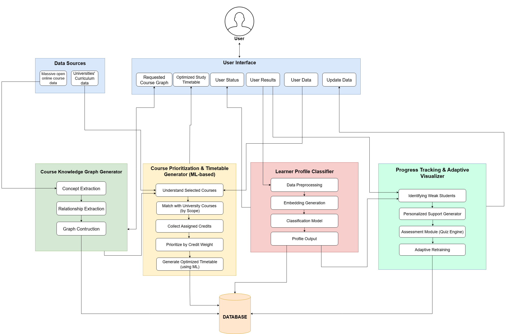

# Personalized Learning Path Recommender for University Undergraduates 🎓

A research project leveraging Neo4j knowledge graphs and AI-driven recommendations to create personalized learning paths for university students, optimizing their course selection and academic progression.

## 👥 Research Team

- **[Team Member 1 Name]** - [Role/ID]
- **[Team Member 2 Name]** - [Role/ID]
- **[Team Member 3 Name]** - [Role/ID]
- **[Team Member 4 Name]** - [Role/ID]

## 📋 Project Overview

This research project develops an intelligent system that generates personalized learning paths for university undergraduates by analyzing course relationships, skills, prerequisites, and student profiles. Using graph database technology and machine learning, the system provides:

- **AI-Driven Course Recommendations**: Intelligent suggestions based on student progress and learning objectives
- **Personalized Learning Paths**: Customized course sequences from introductory to advanced topics
- **Knowledge Graph Integration**: Graph-based representation of course relationships and skill dependencies
- **Progress Tracking & Visualization**: Real-time monitoring of student advancement
- **Adaptive Learning Support**: Dynamic adjustments based on student performance and preferences


### Research Objectives

- Develop an intelligent recommendation system for course selection
- Create a knowledge graph representing course relationships and skill mappings
- Generate optimized learning paths tailored to individual student needs
- Implement progress tracking and adaptive learning mechanisms
- Provide data-driven insights for academic planning

## 🏗️ System Architecture



The system comprises four main components:

### 1. **Course Knowledge Graph Generator**

- Extracts concepts and relationships from course data
- Builds graph structure representing course dependencies
- Integrates with massive open online course (MOOC) data sources

### 2. **Course Prioritization & Timetable Generator (ML-based)**

- Understands selected courses and matches with university curriculum
- Collects assigned credits and prioritizes by weight
- Generates optimized timetables using machine learning algorithms

### 3. **Learner Profile Classifier**

- Data preprocessing and embedding generation
- Classification model for student categorization
- Outputs personalized learner profiles

### 4. **Progress Tracking & Adaptive Visualizer**

- Identifies weak students requiring additional support
- Generates personalized support recommendations
- Assessment module with quiz engine
- Adaptive retraining based on performance

### Technology Stack

```
├── Neo4j Database (Knowledge Graph)
│   ├── Nodes: Courses, Skills, Universities, Difficulty Levels
│   └── Relationships: TEACHES, OFFERED_BY, SIMILAR_TO, RELATED_TO
├── FastAPI Backend (Python REST API)
│   ├── Course Search & Management
│   ├── AI-Driven Recommendation Engine
│   └── Learning Path Generator
├── Machine Learning Models
│   ├── Learner Profile Classification
│   ├── Course Prioritization
│   └── Adaptive Learning Algorithms
└── React Frontend (TypeScript + Vite)
    ├── Interactive Visualizations
    ├── Learning Path Graph (D3.js)
    └── Student Dashboard
```

## 🛠️ Tech Stack

- **Database**: Neo4j 5.x
- **Backend**: FastAPI + Uvicorn
- **Data Processing**: Pandas, NumPy
- **NLP**: Sentence-Transformers (for advanced recommendations)
- **Visualization**: Matplotlib, Seaborn (in Jupyter notebooks)

## 📊 Knowledge Graph Structure

### Nodes

- **Course**: `{id, name, description, rating, url}`
- **University**: `{name}`
- **Skill**: `{name}`
- **DifficultyLevel**: `{level, order}`

### Relationships

- `(Course)-[:OFFERED_BY]->(University)`
- `(Course)-[:TEACHES]->(Skill)`
- `(Course)-[:HAS_DIFFICULTY]->(DifficultyLevel)`
- `(Course)-[:SIMILAR_TO {common_skills}]-(Course)`
- `(Skill)-[:RELATED_TO {strength}]-(Skill)`

## 🚀 Getting Started

### Prerequisites

1. **Python 3.8+**
2. **Neo4j Database**
   - Download [Neo4j Desktop](https://neo4j.com/download/) OR
   - Use [Neo4j Aura](https://neo4j.com/cloud/aura/) (Cloud)

### Installation

1. **Clone the repository**

```bash
cd "course scrape"
```

2. **Install dependencies**

```bash
pip install -r requirements.txt
```

3. **Configure Neo4j**

   - Copy `.env.example` to `.env`
   - Update with your Neo4j credentials:

   ```env
   NEO4J_URI=bolt://localhost:7687
   NEO4J_USER=neo4j
   NEO4J_PASSWORD=your_password
   ```

4. **Import data into Neo4j**

```bash
cd backend
python data_loader.py
```

This will:

- Create indexes for performance
- Import 3,500+ courses
- Create skill relationships
- Compute course similarities

5. **Start the API server**

```bash
cd backend
python main.py
```

API will be available at: `http://localhost:8080`

6. **Start the Frontend** (Optional)

```bash
cd frontend
npm install
npm run dev
```

Frontend will be available at: `http://localhost:5173`

## 📚 API Documentation

Once the server is running, visit:

- **Interactive API Docs**: http://localhost:8000/docs
- **ReDoc**: http://localhost:8000/redoc

### Key Endpoints

#### Course Search

```http
POST /courses/search
{
  "query": "Python programming",
  "difficulty": "Beginner",
  "min_rating": 4.5,
  "limit": 10
}
```

#### Get Course Details

```http
GET /courses/{course_id}
```

#### Get Recommendations

```http
POST /recommendations
{
  "skills": ["Python Programming", "Data Analysis"],
  "difficulty": "Intermediate",
  "limit": 10
}
```

#### Generate Learning Path

```http
POST /learning-path
{
  "target_skill": "Machine Learning",
  "max_courses": 5
}
```

#### Get Statistics

```http
GET /stats
```

## 📓 Jupyter Notebook

Explore the data and test queries in `notebook.ipynb`:

- Dataset exploration and visualization
- Statistical analysis
- Neo4j query examples
- API testing

## 🗂️ Project Structure

```
up-knowledge-graph/
├── backend/               # Backend application
│   ├── main.py           # FastAPI application entry point
│   ├── config.py         # Configuration settings
│   ├── database.py       # Neo4j connection manager
│   ├── data_loader.py    # CSV to Neo4j import script
│   ├── models.py         # Pydantic data models
│   ├── embedding_service.py  # AI embeddings
│   ├── vector_setup.py   # Vector database setup
│   ├── services/         # Business logic layer
│   │   ├── course_service.py
│   │   ├── recommendation_service.py
│   │   ├── learning_path_service.py
│   │   ├── ai_search_service.py
│   │   ├── cross_domain_service.py
│   │   └── stats_service.py
│   ├── data/             # Course datasets
│   │   ├── Coursera.csv
│   │   └── processed/
│   │       └── coursera_cleaned.csv
│   └── notebooks/        # Data analysis notebooks
│       ├── 01_data_exploration.ipynb
│       ├── 02_data_cleaning.ipynb
│       ├── 03_skill_domain_validation.ipynb
│       └── 04_cross_domain_examples.ipynb
├── frontend/             # React frontend application
│   ├── src/
│   │   ├── components/   # React components
│   │   ├── api.ts        # API client
│   │   └── App.tsx       # Main app component
│   ├── package.json
│   └── vite.config.ts
├── images/               # Documentation images
│   ├── project-overview.png
│   └── system-architecture.png
├── run_backend.py        # Backend launcher script
├── run_data_loader.py    # Data import script
├── requirements.txt      # Python dependencies
├── pyproject.toml        # Python project config
├── .env.example          # Environment variables template
├── README.md             # This file
└── SETUP.md              # Setup guide
```

## 🔍 Example Queries

### Find Python courses for beginners

```python
from backend.services import CourseService

courses = CourseService.search_courses(
    query="Python",
    difficulty="Beginner",
    min_rating=4.5,
    limit=5
)
```

### Get similar courses

```python
from services import RecommendationService

similar = RecommendationService.get_similar_courses(
    course_id="abc123",
    limit=10
)
```

### Create learning path to Data Science

```python
path = RecommendationService.get_learning_path(
    target_skill="Data Science",
    max_courses=5
)Research Directions

- [ ] Integration with university learning management systems (LMS)
- [ ] Enhanced student performance prediction models
- [ ] Real-time collaboration features for group learning
- [ ] Multi-modal learning resource recommendations
- [ ] Career path alignment with industry requirements
- [ ] Gamification elements for improved engagement
- [ ] Cross-institutional course credit transfer optimization

## 📊 Research Contributions

1. **Novel Knowledge Graph Structure**: Comprehensive representation of course relationships and skill dependencies
2. **ML-Based Personalization**: Advanced machine learning models for student profiling and course recommendations
3. **Adaptive Learning Framework**: Dynamic adjustment of learning paths based on student progress
4. **Scalable Architecture**: Cloud-ready system design for institutional deployment

## 📝 License

This is a research project for academic purposes.

## 🎓 Acknowledgments

This research project is conducted as part of the university undergraduate research program
MATCH path = (c1:Course)-[:TEACHES]->(:Skill)<-[:TEACHES]-(c2:Course)
WHERE c1.difficulty = 'Beginner'
  AND c2.difficulty = 'Advanced'
RETURN path
LIMIT 5

-- University rankings
MATCH (u:University)<-[:OFFERED_BY]-(c:Course)
RETURN u.name, COUNT(c) as courses, AVG(c.rating) as avg_rating
ORDER BY courses DESC
```

## 🎯 Use Cases

1. **Course Discovery**: Search 3,500+ courses by skills, difficulty, rating
2. **Personalized Recommendations**: Find similar courses based on content
3. **Skill Mapping**: Understand relationships between different skills
4. **Learning Path Planning**: Generate progression from beginner to expert
5. **University Comparison**: Analyze course offerings and quality

## 🔮 Future Enhancements

- [ ] User accounts and personalization
- [ ] Course prerequisite detection
- [ ] Semantic search using embeddings
- [ ] Course completion tracking
- [ ] Advanced skill gap analysis
- [ ] Integration with more course platforms (edX, Udemy, etc.)
- [ ] Web frontend (React/Vue)

## 📝 License

This project is for educational purposes.

## 🤝 Contributing

Contributions are welcome! Feel free to open issues or submit pull requests.

## 📧 Contact

For questions or suggestions, please open an issue on GitHub.

---

**Built with ❤️ using Neo4j, FastAPI, and Python**
